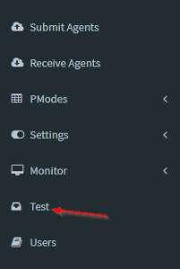
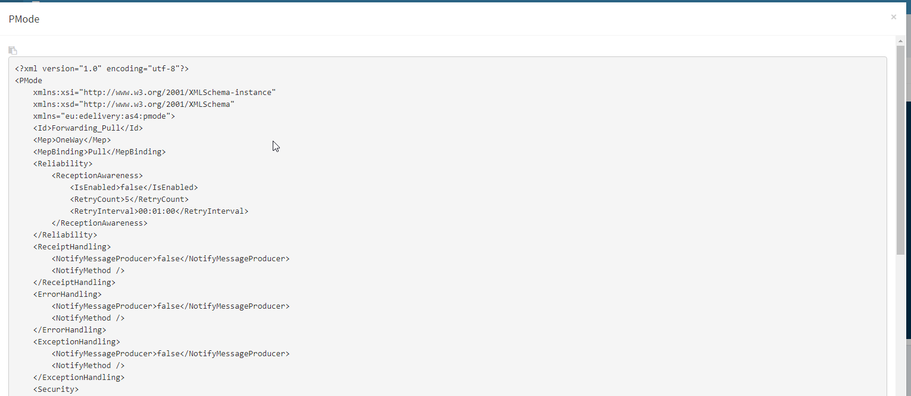

# Message Test Tool

> Note: The configuration for this tool can be changed in the `SubmitTool` configuration section, for this we refer to section about [Appsettings.json](../portal-configuration/page.md).

- The portal contains functionality to create your own AS4 messages. To open the tool, click on the “Test” item in the navigation menu.

    

- The following UI will appear.

    

<table class="wrapped relative-table confluenceTable" style="width: 86.4525%;">
    <colgroup>
        <col style="width: 13.6805%;">
        <col style="width: 86.3489%;">
    </colgroup>
    <tbody>
        <tr>
            <th class="confluenceTh">
                
<strong>Field</strong>

            </th>
            <th class="confluenceTh">
                
<strong>Description</strong>

            </th>
        </tr>
        <tr>
            <td class="confluenceTd">
                
Sending PMode

            </td>
            <td class="confluenceTd">
                
The PMode to be used to send the message.

            </td>
        </tr>
        <tr>
            <td class="confluenceTd">
                
Payloads

            </td>
            <td class="confluenceTd">
                

                    
Attachments you want to add to the AS4 message. Adding attachments can be done using the upload icon or by dragging files on the browser window into the following section: _"No payload(s) added yet. Drop your payloads here."_
  
                

            </td>
        </tr>
        <tr>
            <td class="confluenceTd">
                
# messages

            </td>
            <td class="confluenceTd">
                
Number of messages to generate. Default is 1, maximum is 100.

                
When you create multiple messages then the payload urls will be the same for all the messages.

            </td>
        </tr>
    </tbody>
</table>
    
- After the messages are configured, click on the “Send” button and the logging tab will be opened.
- This tab will be updated with real time information about the sending process. From the logging tab, you can also do the following things.

    

    1. will open a dialog showing you the xml of the AS4 message.

        

    2. “Open message in monitor” will open a new tab showing the message in the monitor.

