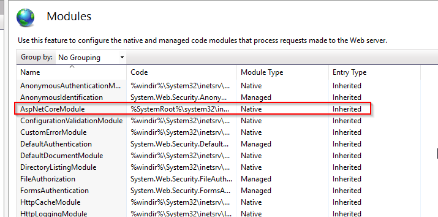
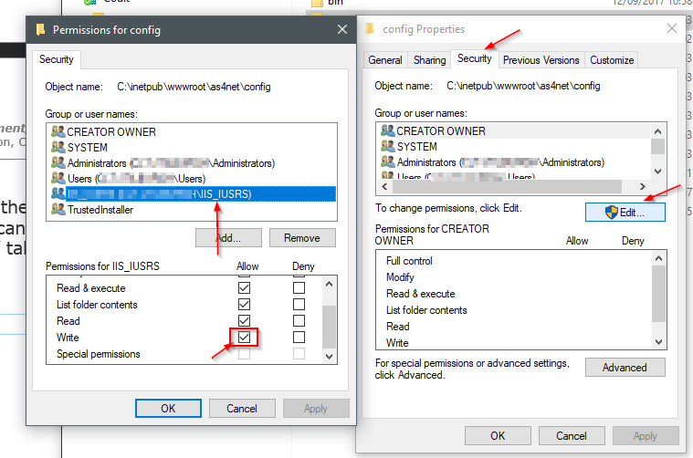
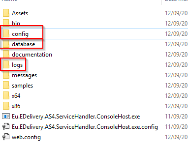

# Portal Configuration

## In Process

In process mode means that the portal and the runtime will run in the same process. This means that when you start the “Eu.EDelivery.AS4.ServiceHandler.ConsoleHost.exe” then also the portal will be available.
This configuration is managed in the “settings.xml” file with the following option: 

Setting the “FeInProcess” value to true means that the “in process” mode is enabled.

> Note: Running the portal “in process” is not the recommended way of running in production! Please see “Run in IIS” for a production setup.

## Dedicated Process

It’s also possible to run the portal in its own process, this can be achieved by setting the “FeInProcess” to false in the “settings.xml” file.

Now when you start the “…consolehost.exe”, the portal won’t be started.
From now on you will have to start the portal using “EU.EDelivery.AS4.Fe.exe”.

Note: Running the portal in its own dedicated process is not the recommended way of running in production! Please see “Run in IIS” for a production setup.

## Run in IIS

> Note: Running the portal using IIS is the recommended way for production!

- Install the latest ASP.NET Core Module, https://github.com/aspnet/AspNetCoreModule, download & install the Windows Hosting package. After that restart IIS.
- To verify if the module has been installed successfully, open “Internet Information (IIS) Manager” and view the modules and make the following module is listed.

- Open IIS Modules View

- “Add Website” in IIS manager

- Enter details for the new website, “Physical path” should point to the root of the extracted AS4 zip package.

- In the root of the AS4 folder create a file “web.config” with the following contents:

  
> Note: If the API doesn’t start, then you can enable the logging output by setting the stdoutLogEnabled option to true. After that all logging will be available in the logs folder.

- Next step is to allow the application pool user write access the following folders, this can be done by right clicking on the folders and going to “security” tab and giving the “IUSER_USRS”

- Folders to give write access:

- Verify that the installation is working by navigating to the configured URL, a setup dialog should appear:

## Enable Microsoft Sql Server

### Authentication database

- Open appsettings.json
- Change the “Provider” & “ConnectionString” properties to “sqlserver” & the ConnectionString matching your sql server setup.

### AS4 Runtime Messages Database

- Open appsettings.json
- Change the “Provider” & “ConnectionString” properties to “sqlserver” & the ConnectionString matching your sql server setup.

## Appsettings.json

In the AS4 package there are 2 configuration files available for the portal. “appsettings.json” & “appsettings.inprocess.json”. All settings in the “appsettings.inprocess.json” are used when running the portal “in process” and settings from “appsettings.json” are used when running in a dedicated process or with IIS.

<table class="relative-table confluenceTable" style="width: 83.7989%;">
    <colgroup>
        <col style="width: 22.7652%;">
        <col style="width: 77.1741%;">
    </colgroup>
    <tbody>
        <tr>
            <th class="confluenceTh">
                
<strong>Setting name</strong>

            </th>
            <th class="confluenceTh">
                
<strong>Description</strong>

            </th>
        </tr>
        <tr>
            <td class="confluenceTd">
                
Port

            </td>
            <td class="confluenceTd">
                
This defines the IP address &amp; port on which the portal should be listening. For ex if you set this to <a href="http://127.0.0.1:9000/">http://127.0.0.1:9000</a>, then the portal will be reachable using a browser at <a href="http://127.0.0.1:9000">http://127.0.0.1:9000</a>.

            </td>
        </tr>
        <tr>
            <td class="confluenceTd">
                
Logging

            </td>
            <td class="confluenceTd">
                
This block is used to configure the internal .NET logging. Since these are settings not specific to the AS4 portal we refer to the Microsoft documentation for this <a href="https://docs.microsoft.com/en-us/aspnet/core/fundamentals/logging#log-filtering">https://docs.microsoft.com/en-us/aspnet/core/fundamentals/logging#log-filtering</a>

            </td>
        </tr>
        <tr>
            <td class="confluenceTd">
                
<strong>Settings</strong>

            </td>
            <td class="confluenceTd">
                
This section contains settings used for the portal.

            </td>
        </tr>
        <tr>
            <td class="confluenceTd">
                <ul>
                    <li style="list-style-type: none;background-image: none;">
                        <ul>
                            <li>ShowStackTraceInExceptions</li>
                        </ul>
                    </li>
                </ul>
            </td>
            <td class="confluenceTd">
                
If true, then a stack trace will be shown in the error dialog when something went something unexpected wrong. This is will contain the server exception! For production, it’s best to set this option to false, to avoid leaking sensitive
                    information.
                

            </td>
        </tr>
        <tr>
            <td class="confluenceTd">
                <ul>
                    <li style="list-style-type: none;background-image: none;">
                        <ul>
                            <li>SettingsXml</li>
                        </ul>
                    </li>
                </ul>
            </td>
            <td class="confluenceTd">
                
This option indicates where the settings.xml used by the runtime is located. Default setting is ‘./config/settings.xml’. You can also specify a UNC path.

            </td>
        </tr>
        <tr>
            <td class="confluenceTd">
                <ul>
                    <li style="list-style-type: none;background-image: none;">
                        <ul>
                            <li>Runtime</li>
                        </ul>
                    </li>
                </ul>
            </td>
            <td class="confluenceTd">
                
The location where all the runtime files are located (DLL’s / exe). Default is ‘.’.

            </td>
        </tr>
        <tr>
            <td class="confluenceTd">
                
<strong>Authentication</strong>

            </td>
            <td class="confluenceTd">
                
Section for configure the authentication of the portal

            </td>
        </tr>
        <tr>
            <td class="confluenceTd">
                <ul>
                    <li style="list-style-type: none;background-image: none;">
                        <ul>
                            <li>Provider</li>
                        </ul>
                    </li>
                </ul>
            </td>
            <td class="confluenceTd">
                
The database provider used for authentication. Default is ‘sqlite’, another possible option id ‘mssql’.

            </td>
        </tr>
        <tr>
            <td class="confluenceTd">
                <ul>
                    <li style="list-style-type: none;background-image: none;">
                        <ul>
                            <li>ConnectionString</li>
                        </ul>
                    </li>
                </ul>
            </td>
            <td class="confluenceTd">
                
The connection string to the authentication database. Default is ‘FileName=users.sqlite’, when setting the provider to ‘mssql’ then a mssql connectionstring is expected here. You can look at <a href="https://www.connectionstrings.com/sql-server/">https://www.connectionstrings.com/sql-server/</a>                    for examples of mssql connection strings.

            </td>
        </tr>
        <tr>
            <td class="confluenceTd">
                <ul>
                    <li style="list-style-type: none;background-image: none;">
                        <ul>
                            <li>JwtOptions.Issuer</li>
                        </ul>
                    </li>
                </ul>
            </td>
            <td class="confluenceTd">
                
A string indicating who issued the JWT token. This can be any string. Default is “<b>AS4.NET</b>”.

            </td>
        </tr>
        <tr>
            <td class="confluenceTd">
                <ul>
                    <li style="list-style-type: none;background-image: none;">
                        <ul>
                            <li>JwtOptions.Audience</li>
                        </ul>
                    </li>
                </ul>
            </td>
            <td class="confluenceTd">
                
A string indicating for which services this JWT token is. This can also be any string. Default is “<a href="http://localhost:5000">http://localhost:5000</a>”.

            </td>
        </tr>
        <tr>
            <td class="confluenceTd">
                <ul>
                    <li style="list-style-type: none;background-image: none;">
                        <ul>
                            <li>JwtOptions.ValidFor</li>
                        </ul>
                    </li>
                </ul>
            </td>
            <td class="confluenceTd">
                
The amount of days that the JWT token is valid. Default is 1 day

            </td>
        </tr>
        <tr>
            <td class="confluenceTd">
                <ul>
                    <li style="list-style-type: none;background-image: none;">
                        <ul>
                            <li>JwtOptions.Key</li>
                        </ul>
                    </li>
                </ul>
            </td>
            <td class="confluenceTd">
                
The secret key used to sign the JWT token. Default is “auf0i3VsjznH6K6imUl2”, but we strongly advice to change this key! This can be configured when the portal is started for the first time!

            </td>
        </tr>
        <tr>
            <td class="confluenceTd">
                
<strong>Monitor</strong>

            </td>
            <td class="confluenceTd">
                
Section containing settings for the monitor module.

            </td>
        </tr>
        <tr>
            <td class="confluenceTd">
                <ul>
                    <li style="list-style-type: none;background-image: none;">
                        <ul>
                            <li>Provider</li>
                        </ul>
                    </li>
                </ul>
            </td>
            <td class="confluenceTd">
                
The database provider used to access the runtime database. Default is “sqlite”, another option is “mssql”.

            </td>
        </tr>
        <tr>
            <td class="confluenceTd">
                <ul>
                    <li style="list-style-type: none;background-image: none;">
                        <ul>
                            <li>ConnectionString</li>
                        </ul>
                    </li>
                </ul>
            </td>
            <td class="confluenceTd">
                
The connection string for the runtime database.

                
Default is “FileName=users.sqlite”, when setting the provider to ‘mssql’ then a mssql connectionstring is expected here. You can look at <a href="https://www.connectionstrings.com/sql-server/">https://www.connectionstrings.com/sql-server/</a>                    for examples of mssql connection strings.

            </td>
        </tr>
        <tr>
            <td class="confluenceTd">
                
<strong>Pmodes</strong>

            </td>
            <td class="confluenceTd">
                
All configuration settings to find PModes.

            </td>
        </tr>
        <tr>
            <td class="confluenceTd">
                <ul>
                    <li style="list-style-type: none;background-image: none;">
                        <ul>
                            <li>SendingPmodeFolder</li>
                        </ul>
                    </li>
                </ul>
            </td>
            <td class="confluenceTd">
                
The folder containing all the sending PModes. This can also be a UNC path.

                
Default is “./config/send-pmodes”.

            </td>
        </tr>
        <tr>
            <td class="confluenceTd">
                <ul>
                    <li style="list-style-type: none;background-image: none;">
                        <ul>
                            <li>ReceivingPmodeFolder</li>
                        </ul>
                    </li>
                </ul>
            </td>
            <td class="confluenceTd">
                
The folder containing all the receiving PModes. This can also be a UNC path.;

                
Default is “./config/receive-pmodes”.

            </td>
        </tr>
        <tr>
            <td class="confluenceTd">
                
<strong>SubmitTool</strong>

            </td>
            <td class="confluenceTd">
                
This section contains all the settings used in the test message tool.

            </td>
        </tr>
        <tr>
            <td class="confluenceTd">
                <ul>
                    <li style="list-style-type: none;background-image: none;">
                        <ul>
                            <li>ToHttpAddress</li>
                        </ul>
                    </li>
                </ul>
            </td>
            <td class="confluenceTd">
                
The MSH endpoint to send messages to.

            </td>
        </tr>
        <tr>
            <td class="confluenceTd">
                <ul>
                    <li style="list-style-type: none;background-image: none;">
                        <ul>
                            <li>PayloadHttpAddress</li>
                        </ul>
                    </li>
                </ul>
            </td>
            <td class="confluenceTd">
                
The HTTP endpoint of a payload service to send payloads to.

            </td>
        </tr>
    </tbody>
</table>