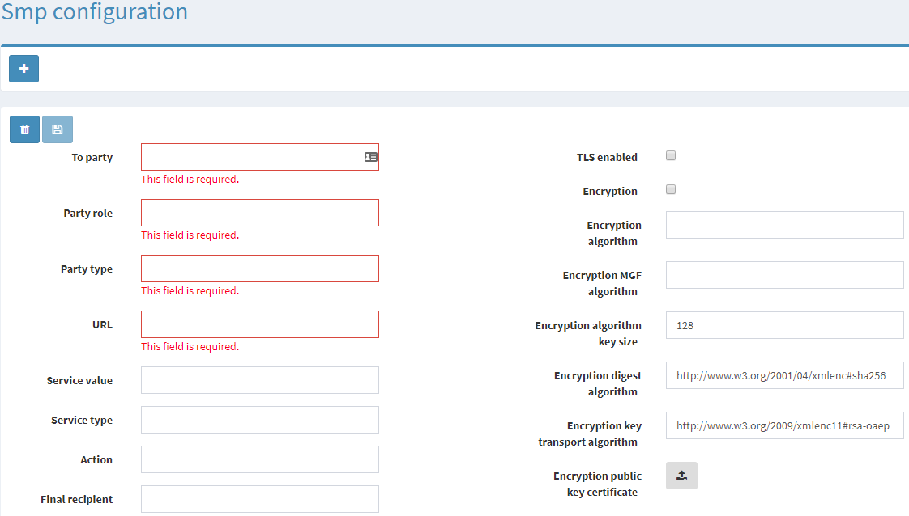

## How to configure _Dynamic Discovery_

### Define the SMP Profile in the _Sending Processing Mode_

To enable _Dynamic Discovery_, a _Sending Processing Mode_ must have a `DynamicDiscovery` element. The value that is configured in this element, refers to a class that implements the `IDynamicDiscoveryProfile` interface.

If no `SMP Profile` is defined, <span>AS4.NET</span> will fall back to a default implementation that uses the routing rules that are defined in the SMP configuration of the <span>AS4.NET</span> MSH.

Following example shows a PMode configured for _Dynamic Discovery_ that will use the (built-in) `LocalDynamicDiscoveryProfile` to retrieve the **SMP Configurations** and to decorate the _Sending Processing PMode_:

```xml
<?xml version="1.0" encoding="utf-8"?>
<PMode
  xmlns:xsi="http://www.w3.org/2001/XMLSchema-instance"
  xmlns:xsd="http://www.w3.org/2001/XMLSchema"
  xmlns="eu:edelivery:as4:pmode">
  <Id>dynamic-discovery-send-pmode</Id>
  <DynamicDiscovery>
  <SmpProfile>Eu.EDelivery.AS4.Services.DynamicDiscovery.LocalDynamicDiscoveryProfile, Eu.EDelivery.AS4, Version=1.0.0.0, Culture=neutral, PublicKeyToken=null</SmpProfile>
  </DynamicDiscovery>
  <MessagePackaging>
    <PartyInfo>
      <FromParty>
        <PartyIds>
          <PartyId>
            <Id>org:eu:europa:as4:example:company:A</Id>
          </PartyId>
        </PartyIds>
        <Role>Sender</Role>
      </FromParty>
    </PartyInfo>
  </MessagePackaging>
</PMode>
```

> Note that only the `FromParty` is filled out, the `ToParty` will be added via the _Dynamic Discovery_ process.

### When will the built-in profile be used

Finally note that the _Dynamic Discovery_ process will use the (build-in) `<LocalDynamicDiscoveryProfile` when the `DynamicDiscovery` element is like: `<DynamicDiscovery/>` or `<DynamicDisovery></DynamicDiscovery>`.

When a `SmpProfile` element is found, it should contain a fully-qualified assembly name of the profile you would like to use.

## Decoration of _Sending Processing Modes_

During the _Dynamic Discovery_, the _Sending Processing Mode_ gets decorated. This means that some values are overwriten and others are left untouched. To correctly **Sent** or **Forward** a message, we need to know some required routing information (such as the `PushConfiguration.Protocol.Url`), but when using _Dynamic Discovery_, this information will be overwritten.

### Local Dynamic Discovery Profile (Default)

The Local profile will use the locally stored **SMP Configurations** in the datastore to decorate the _Sending Processing Mode_. Following values will be overwritten; **all other values are left untouched!**

### Peppol Dynamic Discovery Profile

Dynamic Discovery profile to retrieve a compliant eDelivery SMP profile based on the OpenPEPPOL BIS/CEN BII Service Metadata Publishers (SMP) to extract information about the unknown receiver MSH. After a successful retrieval, the _Sending Processing Mode_ can be extended with the endpoint address, service value/type, action, receiver party and the public encryption certificate of the receiving MSH.

The Peppol profile can be configured with 2 optional properties:

- **SML Scheme** (default: `iso6523-actorid-upis`): is used as the scheme of the URI to contact the SML server.
- **SML Server Domain Name** (default: `isaitb.acc.edelivery.tech.ec.europa.eu`): is used as the domain name of the URI to contact the SML server.

Both properties can be configured in the _Sending Processing Mode_:

```xml
<?xml version="1.0" encoding="utf-8"?>
<PMode
  xmlns:xsi="http://www.w3.org/2001/XMLSchema-instance"
  xmlns:xsd="http://www.w3.org/2001/XMLSchema"
  xmlns="eu:edelivery:as4:pmode">
  <Id>dynamic-discovery-send-pmode</Id>
  <DynamicDiscovery>
    <SmpProfile>Eu.EDelivery.AS4.Services.DynamicDiscovery.PeppolDynamicDiscoveryProfile, Eu.EDelivery.AS4, Version=1.0.0.0, Culture=neutral, PublicKeyToken=null</SmpProfile>
    <Settings>
      <Setting key="SmlScheme">your-sml-scheme</Setting>
      <Setting key="SmpServerDomainName">your-sml-domain-name</Setting>
    </Settings>
  </DynamicDiscovery>
  ...
</PMode>
```

### Oasis Dynamic Discovery Profile

Dynamic Discovery profile to retrieve a compliant eDelivery SMP profile based on the OASIS BDX Service Metadata Publishers (SMP) to extract information about the unknown receiver MSH. After a successful retrieval, the _Sending Processing Mode_ can be extended
with the endpoint address, service value/type, action, receiver party and the public encryption certificate of the receiving MSH.

The Oasis profile can be confgured with the following required property:

- **ServiceProviderDomainName**: is used for the DNS NAPTR lookup to retrieve the SMP REST binding

The profile also has several optional properties to manipulate the SMP retrieval:

- **ServiceProviderSubDomain**: optionally specify a subdomain when performing the SMP server lookup
- **DocumentIdentifier**: used to retrieve the correct SMP information when calling the SMP service
- **DocumentScheme**: used to retrieve the correct SMP information when calling the SMP service

> Note: when both the `DocumentIdentifier` or `DocumentScheme` are missing from the configured properties, the profile will make an extra call to retrieve them. Both properties have to be either specified or unspecified.

All properties can be configured in the _Sending Processing Mode_:

```xml
<?xml version="1.0" encoding="utf-8"?>
<PMode
  xmlns:xsi="http://www.w3.org/2001/XMLSchema-instance"
  xmlns:xsd="http://www.w3.org/2001/XMLSchema"
  xmlns="eu:edelivery:as4:pmode">
  <Id>dynamic-discovery-send-pmode</Id>
  <DynamicDiscovery>
    <SmpProfile>Eu.EDelivery.AS4.Services.DynamicDiscovery.OasisDynamicDiscoveryProfile, Eu.EDelivery.AS4, Version=1.0.0.0, Culture=neutral, PublicKeyToken=null</SmpProfile>
    <Settings>
      <Setting key="ServiceProviderDomainName">your-service-provider-domain-name\</Setting>
      <Setting key="ServiceProviderSubDomain">your-service-provider-sub-domain</Setting>
      <Setting key="DocumentIdentifier">your-document-identifier</Setting>
      <Setting key="DocumentScheme">your-document-scheme</Setting>
    </Settings>
  </DynamicDiscovery>
  ...
</PMode>
```

A _Submit Message_ should be send with a `ToParty` element or else be hard-coded specified in the _Sending Processing Mode_ but this later approach is not recommended since this way _Submit Messages_ will always be send to the same endpoint. This way you're not fully using the capabilities of "Dynamic Discovery".

This `ToParty` element will need at least one `PartyId` with both the `Id` (= **Participant Identifier)** and `Type` (= **Participant Scheme**) filled out because the Oasis profile needs both to build the DNS NAPTR query. All `PartyId` elements with both specified will be tried for a DNS NAPTR query. The first pair that result in a DNS awnser will be used to call the SMP REST binding.

```xml
<?xml version="1.0"?>
<SubmitMessage xmlns="urn:cef:edelivery:eu:as4:messages">
  <Collaboration>
    <AgreementRef>
      <PModeId>dynamic-discovery-send-pmode</PModeId>
    </AgreementRef>
  </Collaboration>
  <PartyInfo>
    <ToParty>
        <Role>Receiver</Role>
        <PartyIds>
            <PartyId>
                <Id>your-participant-identifier</Id>
               <Type>your-participant-scheme</Type>
            </PartyId>
        </PartyIds>
    </ToParty>
  </PartyInfo>
</SubmitMessage>
```

## Specify routing information via the <span>AS4.NET</span> Portal

When using the `LocalDynamicDiscoveryProfile`, the <span>AS4.NET</span> MSH will retrieve the locally stored **SMP Configurations** in the datastore to decorate the _Sending Processing Mode_ during the _Dynamic Discovery_ process. Therefore, to correctly use the `LocalDynamicDiscoveryProfile` the routing information must be specified via the portal so it can be correctly retrieved at run-time.

The routing information that will be added to the _Sending Processing Mode_ will be retrieved by the <span>AS4.NET</span> MSH from a _Service Metadata Publisher_ server. By default, <span>AS4.NET</span> will act as the SMP server if dynamic forwarding is enabled.

The routing information is to be configured via the Web Portal of the <span>AS4.NET</span> component:

- In de sidebar click on the menu item **SMP Configuration**
  - This will show a list of all the configured configurations available for _Dynamic Forwarding_
- To add a new configuration, click the "+" button
  - This will show a dialog
- When finished with the typing of the routing info of your _Sending Processing Mode_, click the button "**OK**"
  - Your configuration is now available during the _Dynamic Forwarding_



> The SMP Configuration needs at least an _Url_ and _ToParty_ _Id_, _Role_, and _Type_
