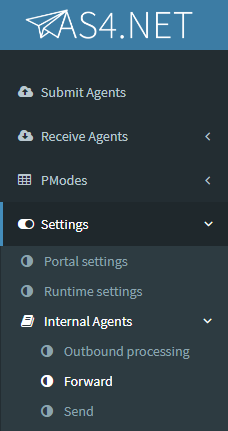

# Setting Up Intermediary MSH (i-MSH)

The <b>AS4.NET</b> component can be configured as a "intermediary". This means that the component is not the final recipiant of the message, and therefore forward the message to the next MSH.

The following section will explain what is required to make <b>AS4.NET</b> component and i-MSH.

## Required Agents for Intermediary MSH

A **Receive**, **Forward**, and **Send Agent** are required for a correctly configured i-MSH. An **Outbound Processing Agent** will also be required to compressed, signed or encrypted the forward messages.


The agents can be configured via the Frontend of the component:

### Add a Receive Agent

- In the sidebar, click on the **Receive Agents** menu

  - This will expand a sub-menu with **Push** and **Pull Receive Agents**.
  - An i-MSH configuration doesn't require a **Receive** configuration so you're free to choose which one.
    

  - Both **Push** and **Pull Agents** will show the same kind of view to add agents
    

- To add an **Agent**, click the "+" button

  - This will show a dialog to either create a new or a clone from another agent:
    
  - After click on the **OK** button and the **Save** button (button with floppy disk icon) the agent is configured on the <b>AS4.NET</b> component.

### Add Forward and Send Agent

The **Forward** and **Send Agents** are both _Internal_ agents, so they can be found in the sub-menu **Internal Agents** in the **Settings** menu.

The same flow as described for the **Receive Agent** is applicable for the **Forward** and **Send Agent**.

> When creating a new agent, the default _Steps_ are automatically assigned to the Agent; only a _Receiver_ is needed when creating an _Agent_.

> Newly created agents will only be part of the <b>AS4.NET</b> component when the component is restarted. Only then these changes will take any effect.



## Receiving Processing Mode for Forward Messages

When a `AS4Message` that needs to be forwarded is received on the **Receive Agent** side, the _Receiving Processing Mode_ that will be matched with this received message should state that the message should be forwarded.

The _Receiving Processing Mode_ has a `<MessageHandling/>` tag which can contain either a `<Deliver/>` or a `<Forward/>` child.
This child element of the `<MessageHandling/>` tag will determine if the incoming message will either be _Delivered_ or _Forwarded_.

The `<Forward/>` element needs one **required element**: the identifier to a _Sending Processing Mode_. Following example shows the structure of this element:

```xml
<PMode>
    ...
    <MessageHandling>
        <Forward>
            <SendingPMode>my-forward-pmode</SendingPMode>
        </Forward>
    </MessageHandling>
</PMode>
```

> Note: if the _Sending Processing Mode_ used during the forwarding has compression, signing or encryption configured, the original message is altered and is therefore not exactly the same as the original message.
