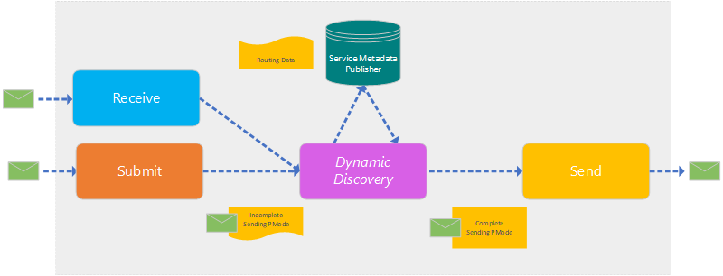

# Dynamic Discovery

## What is _Dynamic Discovery_

Dynamic Discovery allows you to define _Sending Processing Modes_ that do not contain all the specific routing information.  
The _Sending Processing Mode_ that is used to send an AS4 Message is dynamically decorated with the required routing information by the AS4 MSH during the send operation.

Dynamic Discovery makes it possible to have fewer _Sending Processing Modes_:  
Instead of having full blown _Sending Processing Modes_, Dynamic Discovery allows you to have fewer 'incomplete' _Sending Processing Modes_ that act as a template. The missing routing information will be dynamically added by the AS4.NET MessageHandler when an AS4 Message is being sent.
When appropriate, using _Dynamic Discovery_ can save you time since there are fewer _Sending Processing Modes_ to maintain.

## How does _Dynamic Discovery_ work

When _Dynamic Discovery_ is enabled in the _Sending Processing Mode_, AS4.NET will attempt to decorate the _Sending Processing Mode_ with routing information that is retrieved from an SMP server (\_Service Metadata Publisher).

The _Sending Processing Mode_ defines the _SMP Profile_ that must be used to retrieve the routing information. If there's no _SMP Profile_ specified, AS4.NET will use a default profile where AS4.NET itself will act as an SMP server.
In this case, AS4.NET will retrieve routing information from its own routing table and will complete the _Sending Processing Mode_ with this information.
**Any routing information that is already defined in the _Sending Processing Mode_ will be overwritten during this operation!**

In AS4.NET, _Dynamic Discovery_ is supported in both receive/forward/send scenario's and in regular submit/send scenario's:

> Any existing routing information that might already present in the _Sending Processing Mode_ will be overwritten!

## Retrieve Routing Info During Sending or Forwarding

AS4.NET will query the SMP profile (default or custom) to retrieve the routing information that must be used to complete the _Sending Processing Mode_.

This information will be retrieved based on the **ToParty** information; this means that AS4.NET must know the identifier of the `ToParty` to determine the routing information.

- During _Sending_, the routing information is retrieved from either the _SubmitMessage_ or the _Sending Processing Mode_. The _SubmitMessage_'s **ToParty** is used when the _Sending Processing Mode_ has set the `AllowOverride` to `true`; otherwise the **ToParty** from the PMode is used.
  > Note that the _Dynamic Discovery_ will fail if the _Sending Processing Mode_ has set the `AllowOverride` to `false` and the _SubmitMessage_ contains a **ToParty** that's different from the _Sending Processing Mode_ **ToParty**.
- During _Forwarding_, the routing information is retrieved from the _AS4 Message_ itself
